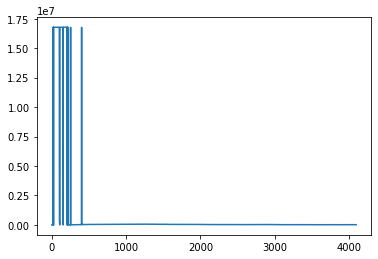
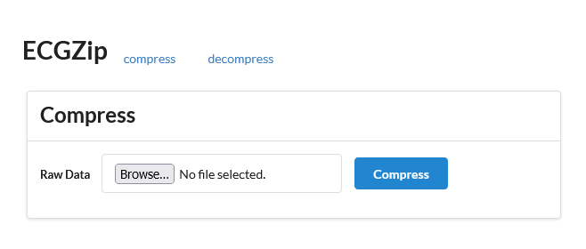
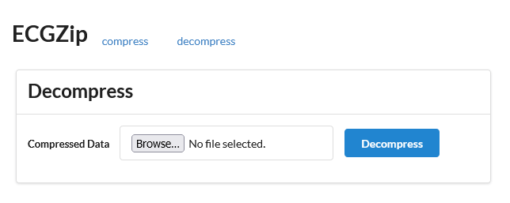

# Compression Scheme

Based on some research, it became clear that for a numerical sequence, there is no ubiquitous solution for lossless compression-- it is very much dependent on the shape of the data.

I took the sample data, parsed it into the series of 3-byte signed integers, and made a quick plot of the values:



So, two things seem apparent:

* The data is seemingly continuous.
* There many spikes up into the upper range, but largely the series is much smaller for the most part.

A common strategy for reducing the space required by continous series is *delta encoding*. Doing so, the values of this series (the deltas between each element of the original) become even smaller. In general, we could probably store those values in 2-bytes since we're wasting the leading bits for most of the file. Unfortunately, the spikes yield deltas of a higher magnitude.

So, this solution stores all values in the 2-byte signed integer range in one sequence of 2-bytes, followed by the rest of the values that require more than 2-bytes to store. While separating the values, we make note of where in the original sequence they go. Also important to keep is the length of the original sequence.

For each of the series,

* "small": 2-byte integers
* "big": 3-byte integers
* "locs": the original indexes of "big" elements

We need to also store the length of that series.

```python
ECGCompressed = Struct(
    "len_origin" / BytesInteger(2, signed=False),
    "len_small" / BytesInteger(2, signed=False),
    "len_big" / BytesInteger(2, signed=False),
    "len_locs" / BytesInteger(2, signed=False),
    "small" / Array(this.len_small, BytesInteger(2, signed=True)),
    "big" / Array(this.len_big, BytesInteger(3, signed=True)),
    "locs" / Array(this.len_locs, BytesInteger(2, signed=False)),
)
```

Decompression works by iterating `i` from 0 to `len_origin` and keeping two other counters to indicate place in the `small` values array (`j`) and place in the `big` values array (`k`). If `i < len_locs and i == locs[k]`, then add `big[k]` to the original sequence and increment `k`, otherwise add `small[j]` to the sequence and increment `j`.

Then, since the sequence compressed is delta encoded we need to also delta decode before we get the final original file data.

Using the `sample_ecg_raw.bin` file provided we're able to compress the original 12285 bytes file to 8225 bytes, yielding a compression ratio of 1.494. For comparison, using Python's `bz2` library yields compressed size of 9327, for a ratio of 1.317.


# Application

The application is built with Django, and uses very basic forms to POST the input file to an endpoint that does simple validation, loads the file into memory, runs compression (or decompression), and writes the file to storage while creating a record of the compressed file, keeping track of size info. To make it as close to something that would run in production as possible, I opted for Postgres for the database and MinIO for the storage backend (which works similar to S3).


## Screenshots



