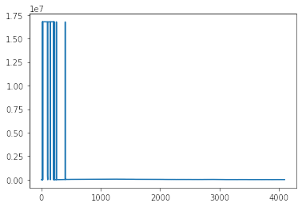

# Compression Scheme

Based on some research, it became clear that for a numerical sequence, there is no ubiquitous solution for lossless compression-- it is very much dependent on the shape of the data.

I took the sample data, parsed it into the series of 3-byte signed integers, and made a quick plot of the values:



So, two things seem apparent:

* The data is seemingly continuous.
* There many spikes up into the upper range, but largely the series is much smaller for the most part.

A common strategy for reducing the space required by continous series is *delta encoding*. Doing so, the values of this series (the deltas between each element of the original) become even smaller. In general, we could probably store those values in 2-bytes since we're wasting the leading bits for most of the file. Unfortunately, the spikes yield deltas of a higher magnitude.

So, this solution stores all values in the 2-byte signed integer range in one sequence of 2-bytes, followed by the rest of the values that require more than 2-bytes to store. While separating the values, we make note of where in the original sequence they go.

For each of the series,

* "small": 2-byte integers
* "big": 3-byte integers
* "locs": the original indexes of "big" elements

We need to also store the length of that series.

```python
ECGCompressed = Struct(
    "len_origin" / BytesInteger(2, signed=False),
    "len_small" / BytesInteger(2, signed=False),
    "len_big" / BytesInteger(2, signed=False),
    "len_locs" / BytesInteger(2, signed=False),
    "small" / Array(this.len_small, BytesInteger(2, signed=True)),
    "big" / Array(this.len_big, BytesInteger(3, signed=True)),
    "locs" / Array(this.len_locs, BytesInteger(2, signed=False)),
)
```
